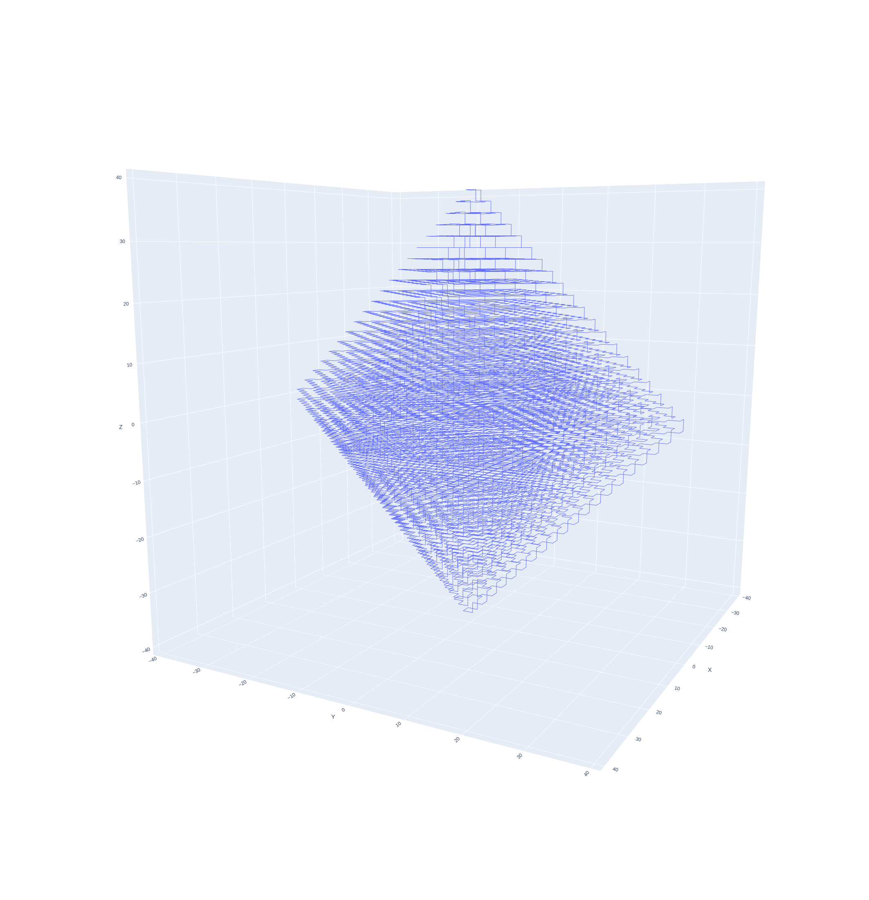

<small><em>Example plot of a solution from weaver</em></small>

# Plot Solution

This Python module uses pandas, numpy and plotly to create a 3d line plot from the .csv file output of the weaver algorithm.


An example .csv file with the headers X, Y, Z, where each entry is a 3d point in the solution.
```
X,Y,Z
1,1,-1
1,-1,-1
-1,-1,-1
-1,1,-1
-1,1,1
-1,-1,1
1,-1,1
1,1,1
1,1,-1
```
<small><em>Solution for a cube</em></small>


## Installation

To build and install the package (including any requirements listed in the 'install_requires' parameter in the setup.py file), in "editable" mode, run the following command:
```
pip install -e .
```

## Usage

Once the package is installed, you can run it from the command line by using the `plot_solution/main.py` command followed by the path to your CSV file:
```
python plot_solution/main.py path/to/csv_file.csv
```
use this if you get the error: `Command 'python' not found, did you mean: ...`
```
python3 plot_solution/main.py path/to/csv_file.csv
```

This will create a 3D line plot you can pan, rotate and inspect using the data from the CSV file.


